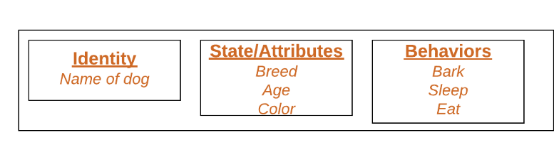

# Introduction:

- Object Oriented Programming is a way of programming that uses classes and objects.
- The oops concept focuses on writing the reusable code. It is a technique to solve the problem by creating objects.

## OOPs Concepts in Python

- Class
- Objects
- Methods
- Inheritance
- Polymorphism
- Encapsulation
- Data Abstraction

# Real World Examples of Classes and Objects:

```
Class: Car

Object 1: A red color Ford
Object 2: A blue color Toyota

Class: Student

Object 1: John, studying Computer Science
Object 2: Smith, studying Biology

Class: Smartphone

Object 1: iPhone 12 with 128GB storage
Object 2: Samsung Galaxy S21 with 256GB storage
```

# Need for creating classes:

- Lets say you want to track the number of students in a college who have different name and age
- For that you can create a list where first element will be students name and second will be his/her age.

```py
student1 = [name, age]
```

- Like this there are 1000 students and they also have some other properties like section,stream,etc.

```py
students = [(name,age, stream,...), (name,age, stream,...), (name,age, stream,...)........]
          #  student1                      student2                      student3 ...............student 10000
```

- Now how to track them???
- This way lacks organization
- It becomes increasingly difficult to manage their data using lists or tuples.
- Thus to create in a organized modular way, classes are needed
- Creating a class called "Student" would allow you to encapsulate all the attributes (name, age, stream, section, etc.) and behaviors (methods) related to a student within a single, well-structured unit.
- Here is the need of classes

# Creating class and its object:

- class is created by keyword class followed by class name
- Class definition Syntax:

```py
class ClassName:
   # Statement-1
   .
   .
   .
   # Statement-N
```

- Example:

```py
class Student:
    name = "Ravi"
    age = 23

```

- What are Attributes ? => the variables that belong to a class.
- Attributes are always public and can be accessed using the dot (.) operator. Eg.: Myclass.Myattribute

```py
class Student:
    name = "Ravi"
    age = 23

print(Student.name)  # Ravi
print(Student.age) # 23
```

> Creating Objects:

- Objects are created using class constructor
- Syntax: Object Definition

```py
obj = ClassName()
print(obj.atrr)
```

- create an object of class student

```py
class Student:
    name = "Ravi"
    age = 23

obj1 = Student()
print(obj1.name)  # Ravi
print(obj1.age) # 23
```

- class containing attributes and methods:

```py
class Student:
    name = "Ravi"
    age = 23

    def isStudying(self):
        return True


obj1 = Student()
print(obj1.name)  # Ravi
print(obj1.age) # 23
print(obj1.isStudying) # 23
```

```
Ravi
23
True
```

# Now Lets see the Definition of classes :

- Class is a collection of objects.
- It is a logical entity that contains some specific attributes(properties) and methods(functions).
- A class acts as a user-defined data structure that binds both data members (attributes) and member functions (methods). By creating an instance of a class, you can access and utilize these data members and member functions.
- A class contains user-defined blueprints or the prototype from which the objects are being created.

```
- Suppose a class is a prototype of a building. A building contains all the details about the floor, rooms, doors, windows, etc. we can make as many buildings as we want, based on these details. Hence, the building can be seen as a class, and we can create as many objects of this class.
```

```
consider class is lika a receipie and we can create as many dish using that
```

- creating an Empty Class:

```py
class Student:
    pass
```

# Now lets see the definition of Objects:

- An Object is an instance of a Class.

```
Consider a class as a blueprint for a house. The blueprint defines the layout, structure, and features of the house. An object, in this context, would be an actual physical house built based on that blueprint. Each house constructed from the same blueprint would have the same basic structure (defined by the class), but they could have different colors, furniture arrangements, and residents (data stored in attributes).
```

- The object is an entity that has a state(variables) and behavior(member function) associated with it.
- Everything in Python is an object, and almost everything has attributes and methods.
- It refers to the fact that in the Python programming language, virtually every piece of data is an instance of some clas
- Integers, strings, floating-point numbers, even arrays, and dictionaries, are all objects.

- So An object consists of:
- 1. State: Represented by the attributes of an object. It also reflects the properties of an object
- 2. Behavior: Represented by the methods of an object. It also reflects the response of an object to other objects.
- 3. Identity: It gives a unique name to an object and enables one object to interact with other objects.
- To understand the state, behavior, and identity let us take the example of the class Student (explained above).
- 1. The identity can be considered as the name of the student.
- 2. State or Attributes can be considered as the section, age, or height of the student.
- 3. The behavior can be considered as to whether the studying is studying or playing

- 

## Declaring Class Objects (Also called instantiating a class):

- When an object of a class is created, the class is said to be instantiated.
- All the instances share the attributes and the behavior of the class. But the values of those attributes, i.e. the state are unique for each object. A single class may have any number of instances
- 

- Creating an object in Python involves instantiating a class to create a new instance of that class. This process is also referred to as object instantiation.

```py
class Student:

    # class Attributes
    name = "Ravi"
    age = 23

    # A sample method
    def fun(self):
        print("My name is ", self.name)
        print("My age is ", self.age)


# Driver code
# Object instantiation
Ravi = Student()

# Accessing class attributes
# and method through objects
print(Ravi.name)
Ravi.fun()
```

```
Ravi
My name is Ravi
My Gender is Male
```

- In the above example, an object is created which is basically a student named Ravi. This class only has two class attributes.
- In this example, we are creating a Student class and we have created two class variables name and age. We have created a method named fun() which returns the string.
- When we define a class, it needs to create an object to allocate the memory:

# Method:

- The method is a function that is created inside class.

# The Self Parameter:

- Self represents the instance of the class or the specified object of the class.
- By using the “self” we can access the attributes and methods of the class in Python.
- It binds the attributes with the given arguments.
- In Python, the self parameter is used within instance methods to refer to the instance itself. This parameter is not received automatically; rather, it's passed explicitly when you call an instance method.

```py
class Student:

    # class Attributes
    name = "Ravi"
    age = "Male"

    # A sample method
    def fun():
        print("My name is ", self.name)
        print("My age is ", self.age)

Ravi = Student()

print(Ravi.name)
Ravi.fun()
```

```
Error
```

- Thats why When we define an instance method in a class, we need to include self as the first parameter. This parameter represents the instance on which the method is being called. .
- If we have a method that takes no arguments, then we still have to have one parameter as self.
- This is similar to this pointer in C++ and this reference in Java.

```py
class Student:

    # class Attributes
    name = "Ravi"
    age = "Male"

    # A sample method
    def fun(self):
        print("My name is ", self.name)
        print("My age is ", self.age)

Ravi = Student()

print(Ravi.name)
Ravi.fun()
```

- The Self Parameter does not call it to be Self, You can use any other name instead of it. Here we change the self to the word someone and the output will be the same.

```py
class Student:

    # class Attributes
    name = "Ravi"
    age = "23"

    # A sample method
    def fun(x):
        print("My name is ", x.name)
        print("My gender is ", x.age)

Ravi = Student()

print(Ravi.name)
Ravi.fun()
```

# What is a Constructor:

- A constructor is a special type of method (function) which is called automaticallly when an object is created
- It is used to initialize the instance members of the class.
- Constructors are used to initializing the object’s state.
- The task of constructors is to initialize(assign values) to the data members of the class when an object of the class is created
- Like methods, a constructor also contains a collection of statements(i.e. instructions) that are executed at the time of Object creation.

# Creating the constructor in python:

# The Python init Method :

- When working with classes, it’s important to understand that in Python, a class constructor is a special method named **init** that gets called when you create an instance (object) of a class.
- The **init** method is similar to constructors in C++ and Java.
- This method is used to initialize the attributes of the object
- Keep in mind that the self parameter in the constructor refers to the instance being created and allows you to access and set its attributes.

```py
class Student:

    def __init__(self, name, stream):
        self.name = name
        self.stream = stream


Ravi = Student('Ravi', 'CSE')
print(Ravi.name)
print(Ravi.CSE)
```

```
Ravi
CSE
```

```py
class Student:

    def __init__(self, name, stream):
        self.name = name
        self.stream = stream


    def display(self):
        print('Hello, my name is', self.name)
        print('Hello, Stream is', self.stream)


Obj = Student('Ravi', 'CSE')
Obj.display()
```

- While creating a Student, “Ravi” and "CSE" is passed as an argument, this argument will be passed to the **init** method to initialize the object.
- The keyword self represents the instance of a class and binds the attributes with the given arguments.
- Similarly, many objects of the Person class can be created by passing different names as arguments.
- Below is the example of init in python with parameters
- Ex of init:

```py
class Student:

    def __init__(self, name, stream):
        self.name = name
        self.stream = stream


    def display(self):
        print('Hello, my name is', self.name)
        print('Hello, Stream is', self.stream)


stud1 = Student('Ravi', 'CSE')
stud2 = Student('Ravi', 'CSE')
stud1.display()
stud2.display()
```

# TYPES OF CONSTRUCTORS

## Non-parameterized Constructor:

- It is used when we do not want to manipulate the value
- It has only self as an argument

```py
class Student:
    # Constructor - non parameterized
    def __init__(self):
        print("This is non parametrized constructor")

    def show(self,name):
        print("Hello",name)

student1 = Student()
student1.show("John")
```

# Parameterized Constructor:

```py
class Student:

    def __init__(self, name):
        print("This is parametrized constructor")
        self.name = name


    def display(self):
        print('Hello, my name is', self.name)

stud1 = Student('Ravi')
stud1.display()
```

## Default Constructor:

- When we don't include or declare constructor in the class, it becomes default constructor
- It does not perform any task but initializes the objects:

```py
class Student:
        name = 'Ravi'
        stream = 'CSE'


    def display(self):
        print('Hello, my name is', self.name)


stud1 = Student()
stud1.display()
```

## More than One Constructor in Single class:

```py
class Student:

    def __init__(self):
        print("First constructor")

    def __init__(self):
        print("Second constructor")

stud1 = Student()
```

```
Second Constructor
```

- Internally, the object of the class will always call the last constructor if the class has multiple constructors.

# str() method:

- Python has a particular method called **str**().
- Used to define how a class object should be represented as a string. It is often used to give an object a human-readable textual representation, which is helpful for logging, debugging, or showing users object information. When a class object is used to create a string using the built-in functions print() and str(), the **str**() function is automatically used. You can alter how objects of a class are represented in strings by defining the **str**() method.

```py
class GFG:
    def __init__(self, name, company):
        self.name = name
        self.company = company

    def __str__(self):
        return f"My name is {self.name} and I work in {self.company}."


my_obj = GFG("John", "GeeksForGeeks")
print(my_obj)
```

```
My name is John and I work in GeeksForGeeks.
```

- In this example, We are creating a class named GFG.In the class, we are creating two instance variables name and company. In the **str**() method we are returning the name instance variable and company instance variable. Finally, we are creating the object of GFG class and we are calling the **str**() method.

- Example:

```py
class Person:
    def __init__(self, name, age):
        self.name = name
        self.age = age

    def __str__(self):
        return f"Person: {self.name}, Age: {self.age}"

person = Person("Alice", 30)
print(person)  # Output: Person: Alice, Age: 30

```

# PROPERTIES OF SELF:

> What is the use of self in Python?

- When working with classes in Python, the term “self” refers to the instance of the class that is currently being used
- It is customary to use “self” as the first parameter in instance methods of a class.
- Whenever you call a method of an object created from a class, the object is automatically passed as the first argument using the “self” parameter.
- This enables you to modify the object’s properties and execute tasks unique to that particular instance.

```py
class mynumber:
    def __init__(self, value):
        self.value = value

    def print_value(self):
        print(self.value)

obj1 = mynumber(17)
obj1.print_value()
```

```
17
```

# Is self in Python a Keyword?

- No, ‘ self ‘ is not a keyword in Python. Self is just a parameter name used in instance methods to refer to the instance itself.
- In a more clear way you can say that SELF has the following Characteristic-

> 1 . Self: Pointer to Current Object

- The self is always pointing to the Current Object. When you create an instance of a class, you’re essentially creating an object with its own set of attributes and methods.

```py
class check:
    def __init__(self):
        print("Address of self = ",id(self))

obj = check()
print("Address of class object = ",id(obj))
```

```
Address of self =  140273244381008
Address of class object =  140273244381008
```

> 2 . Example: Creating Class with Attributes and Methods:

- This code defines a Python class car representing cars with attributes ‘model’ and ‘color’. The **init** constructor initializes these attributes for each instance. The show method displays model and color, while direct attribute access and method calls demonstrate instance-specific data retrieval.

```py
class car():

    # init method or constructor
    def __init__(self, model, color):
        self.model = model
        self.color = color

    def show(self):
        print("Model is", self.model )
        print("color is", self.color )

# both objects have different self which contain their attributes
audi = car("audi a4", "blue")
ferrari = car("ferrari 488", "green")

audi.show()     # same output as car.show(audi)
ferrari.show()  # same output as car.show(ferrari)

print("Model for audi is ",audi.model)
print("Colour for ferrari is ",ferrari.color)
```

```
Model is audi a4
color is blue
Model is ferrari 488
color is green
Model for audi is  audi a4
Colour for ferrari is  green
```

> 3 . Self in Constructors and Methods:

- Self is the first argument to be passed in Constructor and Instance Method.Self must be provided as a First parameter to the Instance method and constructor. If you don’t provide it, it will cause an error.

```py
# Self is always required as the first argument
class check:
    def __init__():
        print("This is Constructor")

object = check()
print("Worked fine")

# Following Error is produced if Self is not passed as an argument
Traceback (most recent call last):
  File "/home/c736b5fad311dd1eb3cd2e280260e7dd.py", line 6, in <module>
    object = check()
TypeError: __init__() takes 0 positional arguments but 1 was given
```

> Self: Convention, Not Keyword:

- Self is a convention and not a Python keyword. Self is a parameter in Instance Method and the user can use another parameter name in place of it. But it is advisable to use self because it increases the readability of code, and it is also a good programming practice.

```py
class this_is_class:
    def __init__(in_place_of_self):
        print("we have used another "
        "parameter name in place of self")

object = this_is_class()
```

```
we have used another parameter name in place of self
```

## Doc strings:

- In Python, classes can indeed have documentation strings, also known as docstrings.
- A docstring is a string literal that is the first statement in a class, function, module, or method definition. It's used to provide documentation and information about the purpose, usage, and behavior of the class or function.
- The docstring for a class can be accessed using the **doc** attribute of the class object i.e which can be accessed by using class-name.**doc**

```py
class MyClass:
    """
    This is a docstring for the MyClass class.
    It provides information about the class.
    """

    def __init__(self, value):
        self.value = value

    def get_value(self):
        """This method returns the value stored in the object."""
        return self.value

# Accessing the class docstring
print(MyClass.__doc__)

```

## Class and Instance Variables

- All instances of a class exchange class variables. They function independently of any class methods and may be accessed through the use of the class name. Here's an illustration:

```py
class Person:
    count = 0   # This is a class variable

    def __init__(self, name, age):
        self.name = name    # This is an instance variable
        self.age = age
        Person.count += 1   # Accessing the class variable using the name of the class
person1 = Person("Ayan", 25)
person2 = Person("Bobby", 30)
print(Person.count) # 2
```

- Whereas, instance variables are specific to each instance of a class. They are specified using the self-argument in the **init** method. Here's an illustration:

```py
class Person:
    def __init__(self, name, age):
        self.name = name    # This is an instance variable
        self.age = age
person1 = Person("Ayan", 25)
person2 = Person("Bobby", 30)
print(person1.name)
print(person2.age)
```

```
Ayan
30
```

- Class variables are created separately from any class methods and are shared by all class copies. Every instance of a class has its own instance variables, which are specified in the **init** method utilising the self-argument.

- Instance variables are for data, unique to each instance and class variables are for attributes and methods shared by all instances of the class. Instance variables are variables whose value is assigned inside a constructor or method with self whereas class variables are variables whose value is assigned in the class.

- Defining instance variables using a constructor:

```py
# Python3 program to show that the variables with a value
# assigned in the class declaration, are class variables and
# variables inside methods and constructors are instance
# variables.

# Class for Dog


class Dog:

    # Class Variable
    animal = 'dog'

    # The init method or constructor
    def __init__(self, breed, color):

        # Instance Variable
        self.breed = breed
        self.color = color


# Objects of Dog class
Rodger = Dog("Pug", "brown")
Buzo = Dog("Bulldog", "black")

print('Rodger details:')
print('Rodger is a', Rodger.animal)
print('Breed: ', Rodger.breed)
print('Color: ', Rodger.color)

print('\nBuzo details:')
print('Buzo is a', Buzo.animal)
print('Breed: ', Buzo.breed)
print('Color: ', Buzo.color)

# Class variables can be accessed using class
# name also
print("\nAccessing class variable using class name")
print(Dog.animal)
```

```
Rodger details:
Rodger is a dog
Breed:  Pug
Color:  brown
Buzo details:
Buzo is a dog
Breed:  Bulldog
Color:  black
Accessing class variable using class name
dog
```

- A class named Dog is defined with a class variable animal set to the string “dog”. Class variables are shared by all objects of a class and can be accessed using the class name. Dog class has two instance variables breed and color. Later we are creating two objects of the Dog class and we are printing the value of both objects with a class variable named animal.

> Defining instance variables using the normal method:

```py
# Python3 program to show that we can create
# instance variables inside methods

# Class for Dog


class Dog:

    # Class Variable
    animal = 'dog'

    # The init method or constructor
    def __init__(self, breed):

        # Instance Variable
        self.breed = breed

    # Adds an instance variable
    def setColor(self, color):
        self.color = color

    # Retrieves instance variable
    def getColor(self):
        return self.color


# Driver Code
Rodger = Dog("pug")
Rodger.setColor("brown")
print(Rodger.getColor())
```

```
brown
```

- In this example, We have defined a class named Dog and we have created a class variable animal. We have created an instance variable breed in the constructor. The class Dog consists of two methods setColor and getColor, they are used for creating and initializing an instance variable and retrieving the value of the instance variable. We have made an object of the Dog class and we have set the instance variable value to brown and we are printing the value in the terminal.

# What is OOPs?

- In order to understand what is Object oriented Programming. We need to understand what are objects first

# What are objects?

- In order to understand objects..first we need to leran primitive data types first.

# What are primitive data types?

- Variables that store single and simple values
- Stores single piece of data of some kind
- Ex: Byte, Int, Float, Boolean, Double, Char.
- These data types were usefull till one extent.
- But when programs became large and complex, these data types were not that usefull.
- We needed variables to store simmillar types of data together.

## Classes & Objects:

- Class is an Object constructor or blueprint for creating objects
- "class" keyword is used to create class

```py
class Student:
    name = "Ravi"

print(Student)
```

```
<class '__main__.Student'>
```

- Objects are created using class name:

```py
class Student:
    name = "Ravi"

#creating object

obj1 = Student()
print(obj1.name)  # Ravi
```

- To understand the meaning of classes we have to understand the built-in **init**() function.

## The init Function:

```
- All classes have a function called __init__(), which is always executed when the class is being initiated.
- __init__() function is used to assign values to object properties
```

```
- Question: Create a class named Student and use **init**() function to assign values
```

```py
class Student:
    def __init__(self, name, age):
        self.name = name
        self.age = age

obj1 = Student("Ravi", 23)

print(obj1.name) # Ravi
print(obj1.age) # 23
```

- The init function is called automatically every time the class is being used to create a new object.

## str() function:

- controls what should be returned when the class object is represented as string:
- without str function:

```py
class Student:
    def __init__(self, name, age):
        self.name = name
        self.age = age

obj1 = Student("Ravi", 23)

print(obj1)
```

```
<__main__.Student object at 0x2afc51539100>
```

- With str() function:

```py
class Student:
    def __init__(self, name, age):
        self.name = name
        self.age = age

    def __str__(self):
        return f"{self.name}({self.age})"

obj1 = Student("Ravi", 23)

print(obj1) # Ravi(23)
```

> The Self parameter:

- self parameter refers to the current instance of the class.
- Used to access class variables.
- It can be named anything but it has to be the first parameter of any function in the class

```py
class Student:
    def __init__(x, name, age):
        x.name = name
        x.age = age

    def intro(xyz):
        print("My name is "+xyz.name)

obj1 = Student("Ravi", 23)

print(obj1.name)  # Ravi
print(obj1.age)  # 23

obj1.intro() # My name is Ravi
```

> Modify object properties

```py
class Student:
    def __init__(self, name, age):
        self.name = name
        self.age = age

obj1 = Student("Ravi", 23)
obj1.age = 22
print(obj1.age) # 22
```

> Delete Object Properties

- using del keyword:

```py
class Student:
    def __init__(self, name, age):
        self.name = name
        self.age = age

obj1 = Student("Ravi", 23)

del obj1.age # Deletes the age property

print(obj1.age)  # AttributeError: 'Student' object has no attribute 'age'

del obj1 # deletes the whole object
```

> The Pass Statement:

- Class definitions cannot be empty:
- To avoid error, use pass statement.

```py
class Student:
    pass
```

## FREECODECAMP (STRORE MANAGEMENT SYSTEM)

- Tracking items that we have in our store using variables

```py
item1 = "Phone"
item1_price = 100
item1_quantity = 5
item1_price_total = item1_price * item1_quantity

# these variables are instances of different classes
print(type(item1))
print(type(item1_price))
print(type(item1_quantity))
print(type(item1_price_total))
```

```
<class 'str'>
<class 'int'>
<class 'int'>
<class 'int'>
```

- So in python, each data type is an object that has been instantiated earlier by some class
- In the above example, variable item1 has been instantitaed from a string type of class. Similarly other three variables are instantiated from a int type of class.
- Now it could have been nicer if we could create a data type of our own. It will allow us to write a code that we can reuse in the future easily if needed.
- Now each instance have attributes to describe information related about it.
- Instantiate some objects of a class is same as creating some objects of a class

> Creating class and objects

```py
class Item:
    pass

item = Item()

"""
same as
myStr = str(4)
"""
```

> now creating attributes:

- using dot sign
- Each of the 4 variables are assigned to one instance of the class

```py
class Item:
    pass

item1 = Item()
item1.name = "Phone"
item1.price = 100
item1.quantity = 5

print(type(item1))
print(type(item1.name))
print(type(item1.price))
print(type(item1.quantity))
```

```
<class '__main__.Item'>
<class 'str'>
<class 'int'>
<class 'int'>
```

> creating methods inside instances

- methods are functions created inside classes
- self is the paramter that python wants us to recieve intentionally
- This is because python passes the object itself as the first argument when you call the methods
- Thats why we are not allowed to create methods that doesnot receive paramters

```py
class Item:
    def calculate_total_price():
        pass

item1 = Item()
item1.name = "Phone"
item1.price = 100
item1.quantity = 5

item1.calculate_total_price()
```

```
TypeError: Item.calculate_total_price() takes 0 positional arguments but 1 was given
```

- This shows that python tries to pass one argument and you are not receiving it using any paramter.
- Thats why you always have to receive one parameter while creating methods.
- Since it always receive this parameter, we call it self

```py
class Item:
    def calculate_total_price(self):
        pass

item1 = Item()
item1.name = "Phone"
item1.price = 100
item1.quantity = 5

item1.calculate_total_price()
```

```
No Error
```

- Now pass more parameter to calculate the price

```py
class Item:
    def calculate_total_price(self, x, y):
        return x*y

item1 = Item()
item1.name = "Phone"
item1.price = 100
item1.quantity = 5

print(item1.calculate_total_price(item1.price, item1.quantity)) # 500

# item1 passed as self
# item1.price passed as x
# item1.quantity passesd as y
```

- Multiple instances:

```py
class Item:
    def calculate_total_price(self, x, y):
        return x*y

item1 = Item()
item1.name = "Phone"
item1.price = 100
item1.quantity = 5

print(item1.calculate_total_price(item1.price, item1.quantity)) # 500

class Item:
    def calculate_total_price(self, x, y):
        return x*y

item2 = Item()
item2.name = "Phone"
item2.price = 1000
item2.quantity = 3

print(item2.calculate_total_price(item2.price, item2.quantity)) # 3000
```

> problem1:

- for each item of an instance , we need to hard code in the attribute name. Like:

```py
item1 = Item()
item1.name = "Phone"
item1.price = 100
item1.quantity = 5
```

- Here comes a special method named init method which is also called as constructor:
- Now when you create an instance of a class, python automatically executes this method and performs all the actions inside this method.
- for example:

```py
class Item:
    def __init__(self):
        print("init Method Executed")

item1 = Item()
```

```
init Method Executed
```

- This will get execute every time an object(or instance) is created.

```py
class Item:
    def __init__(self):
        print("init Method Executed")

item1 = Item()
item2 = Item()
```

- Now how to avoid hard coding the attributes:
- Since we got to know that every time an instance is created, the init method gets executed.
- We can use this to receive certain parameters , along with self(since it is mandatory)
- For example: lets pass the name attribute

```py
class Item:
    def __init__(self, name):
        print(f"An Instance Created: {name}")

item1 = Item("Phone")
item1.name = "Phone"

item2 = Item("Laptop")
item2.name = "Laptop"
```

```
An Instance Created: Phone
An Instance Created: Laptop
```

- now we can dynamically assign the atrributes inside the init method.

```py
class Item:
    def __init__(self, name):
        self.name = name
        print(f"An Instance Created: {name}")

item1 = Item("Phone")
item2 = Item("Laptop")

print(item1.name)
print(item2.name)
```

```
An Instance Created: Phone
An Instance Created: Laptop
Phone
Laptop
```

- Similarily doing the same for all atributes:

```py
class Item:
    def __init__(self,name,price,quantity):
        self.name = name
        self.price = price
        self.quantity = quantity

    def calculate_total_price(self, x, y):
        return x*y

item1 = Item("Phone",1000,5)
item2 = Item("Realme",1000,3)

print(item1.name)
print(item2.name)
print(item1.price)
print(item2.price)
print(item1.quantity)
print(item2.quantity)
```

```
Phone
Realme
1000
1000
5
3
```

- Default parameters:

```py
class Item:
    def __init__(self,name,price,quantity=0):
        self.name = name
        self.price = price
        self.quantity = quantity

    def calculate_total_price(self, x, y):
        return x*y

item1 = Item("Phone",1000)
item2 = Item("Realme",1000)

print(item1.name)
print(item2.name)
print(item1.price)
print(item2.price)
print(item1.quantity)
print(item2.quantity)
```

```
Phone
Realme
1000
1000
0
0
```

- You can add some attributes specially for some instances
- Like: check whether a laptop has numpad or not:

```py
class Item:
    def __init__(self,name,price,quantity=0):
        self.name = name
        self.price = price
        self.quantity = quantity

    def calculate_total_price(self, x, y):
        return x*y

item1 = Item("Phone",1000)
item2 = Item("Realme",1000)

item2.has_numpad = False
```

- We aldo don't need to pass x,y. We can use self since we are passing the object iteslf as self parameter:

```py
class Item:
    def __init__(self,name,price,quantity=0):
        self.name = name
        self.price = price
        self.quantity = quantity

    def calculate_total_price(self):
        return self.price*self.quantity

item1 = Item("Phone",1000, 2)
item2 = Item("Realme",1000, 3)

print(item1.calculate_total_price()) #2000
print(item2.calculate_total_price()) #3000
```

- See what happens if i pass the price values as string types:

```py
class Item:
    def __init__(self,name,price,quantity=0):
        self.name = name
        self.price = price
        self.quantity = quantity

    def calculate_total_price(self):
        return self.price*self.quantity

item1 = Item("Phone","1000", 2)
item2 = Item("Realme","1000", 3)

print(item1.calculate_total_price())
print(item2.calculate_total_price())
```

```
10001000
100010001000
```

- Thus, We need to validate the data types of the values that we are passing in.
- There different ways to do this:
- First one is mentioning the type of data that is receiving:

```py
class Item:
    def __init__(self,name: str,price: float,quantity=0):
        self.name = name
        self.price = price
        self.quantity = quantity

    def calculate_total_price(self):
        return self.price*self.quantity

item1 = Item("Phone",1000, 2)

# with float mentioned, we can pass int alos
# since default value of quantity is 0, no need to mention
# integer
```

- Adding more validation:
- Suppose letssay we don't want to receive a negative number for price and quantity.
- This cannot acheived by typing.
- For that we will use assert statements
- Its is a statement to check what is happening to your expectations.

```py
class Item:
    def __init__(self,name: str,price: float,quantity=0):

        # Run validations to received arguments:
        assert price >= 0
        assert quantity >= 0

        # Assign to self object
        self.name = name
        self.price = price
        self.quantity = quantity

    def calculate_total_price(self):
        return self.price*self.quantity

item1 = Item("Phone",1000, 2)
print(item1.calculate_total_price()) # 2000
```

- now if we pass negative numbers, it will show errors:

```py
class Item:
    def __init__(self,name: str,price: float,quantity=0):

        # Run validations to received arguments:
        assert price >= 0
        assert quantity >= 0

        # Assign to self object
        self.name = name
        self.price = price
        self.quantity = quantity

    def calculate_total_price(self):
        return self.price*self.quantity

item1 = Item("Phone",1000, -2)
print(item1.calculate_total_price())
```

```
AssertionError
```

- With assert statements we can add our own exception messages:

```py
class Item:
    def __init__(self,name: str,price: float,quantity=0):

        # Run validations to received arguments:
        assert price >= 0, f"Price {price} is not greater than zero !"
        assert quantity >= 0, f"Quantity {quantity} is not greater than zero !"

        # Assign to self object
        self.name = name
        self.price = price
        self.quantity = quantity

    def calculate_total_price(self):
        return self.price*self.quantity

item1 = Item("Phone",1000, -2)
print(item1.calculate_total_price())
```

```
AssertionError: Quantity -2 is not greater than zero !
```

- Till now what we learnt are instance attributes.
- Now consider a situation that you want to make use of an attribute that is global(i.e used across all instances)
- Those attributes are called class attributes
- Class attribute is an attribute that is going to be belong to the class itself. But you can also access this attribute from the instance level as well
- Ex: creating a class attribute:

```py
class Item:
    pay_rate = 0.8 # The pay rate after 20% discount
    def __init__(self,name: str,price: float,quantity=0):

        # Run validations to received arguments:
        assert price >= 0, f"Price {price} is not greater than zero !"
        assert quantity >= 0, f"Quantity {quantity} is not greater than zero !"

        # Assign to self object
        self.name = name
        self.price = price
        self.quantity = quantity

    def calculate_total_price(self):
        return self.price*self.quantity

item1 = Item("Phone",1000, 2)

# Accessing class atrribute from class level:
print(Item.pay_rate) # 0.8

# Accessing class attributes from instance level:
print(item1.pay_rate) # 0.8
print(item2.pay_rate) # 0.8
```

- This might be little confusing:

```
print(item1.pay_rate) # 0.8
print(item2.pay_rate) # 0.8
```

- these two statements will first check for the attribute in the instance level(i.e inside the init method)
- If it doesnot find there, then it will check in class level
- Now there is a built-in magic attribute(**dict**) with which we can see all the attributes that are belonging to that specific object

```py
class Item:
    pay_rate = 0.8 # The pay rate after 20% discount
    def __init__(self,name: str,price: float,quantity=0):

        # Run validations to received arguments:
        assert price >= 0, f"Price {price} is not greater than zero !"
        assert quantity >= 0, f"Quantity {quantity} is not greater than zero !"

        # Assign to self object
        self.name = name
        self.price = price
        self.quantity = quantity

    def calculate_total_price(self):
        return self.price*self.quantity

item1 = Item("Phone",1000, 2)
print(Item.pay_rate) # Print all the attributes of class level
print(item1.pay_rate) # Print all the attributes of instance level
```

```
{'__module__': '__main__', 'pay_rate': 0.8, '__init__': <function Item.__init__ at 0x7f0ca69a6c00>, 'calculate_total_price': <function Item.calculate_total_price at 0x7f0ca69a6ca0>, '__dict__': <attribute '__dict__' of 'Item' objects>, '__weakref__': <attribute '__weakref__' of 'Item' objects>, '__doc__': None}
{'name': 'Phone', 'price': 1000, 'quantity': 2}
>
```

- It returns all the attributes in a dictionary form. That why it is named so.

- Adding discount function:

```py
class Item:
    pay_rate = 0.8 # The pay rate after 20% discount
    def __init__(self,name: str,price: float,quantity=0):

        # Run validations to received arguments:
        assert price >= 0, f"Price {price} is not greater than zero !"
        assert quantity >= 0, f"Quantity {quantity} is not greater than zero !"

        # Assign to self object
        self.name = name
        self.price = price
        self.quantity = quantity

    def calculate_total_price(self):
        return self.price*self.quantity

    def apply_discount(self):
        self.price = self.price * Item.pay_rate

item1 = Item("Phone",100, 2)
item1.apply_discount()
print(item1.price) #80.0
```

- Now lets say you want to give a different discount of 30% for laptop only. If we change the pay_rate at class level from 0.8 to 0.7 , it will affect all
- So the solution is:

```py
class Item:
    pay_rate = 0.8 # The pay rate after 20% discount
    def __init__(self,name: str,price: float,quantity=0):

        # Run validations to received arguments:
        assert price >= 0, f"Price {price} is not greater than zero !"
        assert quantity >= 0, f"Quantity {quantity} is not greater than zero !"

        # Assign to self object
        self.name = name
        self.price = price
        self.quantity = quantity

    def calculate_total_price(self):
        return self.price*self.quantity

    def apply_discount(self):
        self.price = self.price * Item.pay_rate

item1 = Item("Phone",100, 2)
item1.apply_discount()
print(item1.price) #80.0

item2 = Item("Laptop",1000,3)
item2.pay_rate = 0.7
item2.apply_discount()
print(item2.price) # 700.0

```

- So here for second item, since we are mentioning pay_rate at instance level, it should take that value and will not check at class level.
- But it still printing 20% discount. This is because inside discount function, we have mentioned Item.pay_rate
- Need to mention self.pay_rate
- Now since self is mentioned, for both the items, it will first check the value of pay_rate at instance level.
  For item1 at instance level, it will not find the value, so it will pull it from class level

- Now consider you have a large shop having more items. Currently in the class, we don't have any resource where we can access all items that we have in our shop.
- currently there is not an approach thet will give us a list with five different elements where each element will represent an instance of a class.
- So for this, we could create a class attribute that could name all:

```py
class Item:
    pay_rate = 0.8 # The pay rate after 20% discount
    all = []
    def __init__(self,name: str,price: float,quantity=0):

        # Run validations to received arguments:
        assert price >= 0, f"Price {price} is not greater than zero !"
        assert quantity >= 0, f"Quantity {quantity} is not greater than zero !"

        # Assign to self object
        self.name = name
        self.price = price
        self.quantity = quantity

        # Append every time an instance is created
        # uaing class object first
        Item.all.append(self)
        # self is the instance that is everytime created

    def calculate_total_price(self):
        return self.price*self.quantity

    def apply_discount(self):
        self.price = self.price * Item.pay_rate

item1 = Item("Phone",100, 2)
item2 = Item("Laptop",1000,3)
item3 = Item("Earbuds",500,1)

print(Item.all) # will print list of 3 instances
```

```
[<__main__.Item object at 0x7f0189582c50>, <__main__.Item object at 0x7f0189582c90>, <__main__.Item object at 0x7f0189582cd0>]
```

- The output is not too user friendly
- It would be nicer if we could change the way the object is being represented in this list here
- This can be acheived by a magic method called --repr--:
- It stands for representing your objects. There is also another method like this(**str**)

```py
class Item:
    pay_rate = 0.8 # The pay rate after 20% discount
    all = []
    def __init__(self,name: str,price: float,quantity=0):

        # Run validations to received arguments:
        assert price >= 0, f"Price {price} is not greater than zero !"
        assert quantity >= 0, f"Quantity {quantity} is not greater than zero !"

        # Assign to self object
        self.name = name
        self.price = price
        self.quantity = quantity

        # Append every time an instance is created
        # uaing class object first
        Item.all.append(self)
        # self is the instance that is everytime created

    def calculate_total_price(self):
        return self.price*self.quantity

    def __repr__(self):
        return f"Item('{self.name}','{self.price}','{self.quantity}')"

    def apply_discount(self):
        self.price = self.price * Item.pay_rate

item1 = Item("Phone",100, 2)
item2 = Item("Laptop",1000,3)
item3 = Item("Earbuds",500,1)

print(Item.all) # will print list of 3 instances
```

```
[Item('Phone','100','2'), Item('Laptop','1000','3'), Item('Earbuds','500','1')]
```

- Lets say we want to print all names of the instances:
- We can do it using a for loop

```py
class Item:
    pay_rate = 0.8 # The pay rate after 20% discount
    all = []
    def __init__(self,name: str,price: float,quantity=0):

        # Run validations to received arguments:
        assert price >= 0, f"Price {price} is not greater than zero !"
        assert quantity >= 0, f"Quantity {quantity} is not greater than zero !"

        # Assign to self object
        self.name = name
        self.price = price
        self.quantity = quantity

        # Append every time an instance is created
        # uaing class object first
        Item.all.append(self)
        # self is the instance that is everytime created

    def calculate_total_price(self):
        return self.price*self.quantity

    def apply_discount(self):
        self.price = self.price * Item.pay_rate

item1 = Item("Phone",100, 2)
item2 = Item("Laptop",1000,3)
item3 = Item("Earbuds",500,1)

print(Item.all) # will print list of 3 instances

for instance in Item.all:
    print(instance.name)
```

```
Phone
Laptop
Earbuds
```

# Notes:

- OOPs helps to implement real-world entities like inheritance, polymorphisms, encapsulation, etc. in the programming.
- How these are real world entities. We will explain it later.
- The main concept of OOPs is to bind the data and the functions that work on that together as a single unit so that no other part of the code can access this data
-

```
When we call a method of this object as myobject.method(arg1, arg2), this is automatically converted by Python into MyClass.method(myobject, arg1, arg2) – this is all the special self is about.
```

```py
class GFG:
    def __init__(self, name, company):
        self.name = name
        self.company = company

    def show(self):
        print("Hello my name is " + self.name+" and I" +
              " work in "+self.company+".")


obj = GFG("John", "GeeksForGeeks")
obj.show()
```

```
Hello my name is John and I work in GeeksForGeeks.
```

```py
class GFG:
    def __init__(somename, name, company):
        somename.name = name
        somename.company = company

    def show(somename):
        print("Hello my name is " + somename.name +
              " and I work in "+somename.company+".")


obj = GFG("John", "GeeksForGeeks")
obj.show()
```

```
Hello my name is John and I work in GeeksForGeeks.
```

- In this example, we are creating a GFG class and we have created the name, and company instance variables in the constructor. We have created a method named say_hi() which returns the string “Hello my name is ” + {name} +” and I work in “+{company}+”.”.We have created a person class object and we passing the name John and Company GeeksForGeeks to the instance variable. Finally, we are calling the show() of the class.

# Differenc between Object-oriented and Procedural Programming:

```
- Object-oriented programming is the problem-solving approach and used where computation is done by using objects.

- Procedural programming uses a list of instructions to do computation step by step
```

```
Object-oriented programming makes the development and maintenance easier.

In procedural programming, It is not easy to maintain the codes when the project becomes lengthy.
```

```
Object-oriented programming simulates the real world entity. So real-world problems can be easily solved through oops.

procedural programming doesn't simulate the real world. It works on step by step instructions divided into small parts called functions.
```

```
Object-oriented programming provides data hiding. So it is more secure than procedural languages. You cannot access private data from anywhere.

Procedural language doesn't provide any proper way for data binding, so it is less secure.
```

```
Example of object-oriented programming languages is C++, Java, .Net, Python, C#, etc.

Example of procedural languages are: C, Fortran, Pascal, VB etc.
```
