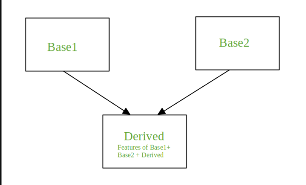
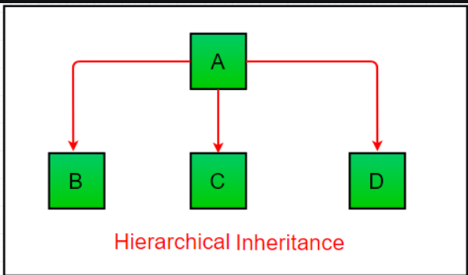
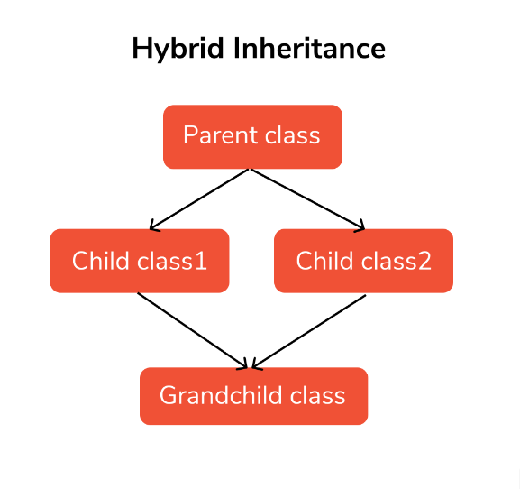
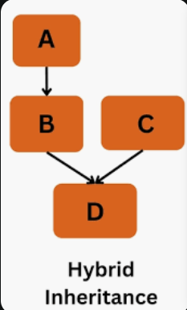

# INHERITANCE:

> Syntax:

```
Class BaseClass:
    {Body}
Class DerivedClass(BaseClass):
    {Body}
```

> composition rather than inheritance:

- In the below example, the Car class is not explicitly inheriting from the Vehicle class, but it's using a property (name) of the Vehicle class. This is a form of composition, where one class is composed of or uses another class as a component.
- This code doesn't involve explicit inheritance, but it shows how one class (Car) can use attributes from another class (Vehicle) through composition.

```py
class Vehicle:
    # class attribute
    name = "Mercedes"

class Car(Vehicle):
    def drive(self):
        return "I am driving "+Vehicle.name

car = Car()

print(car.drive()) # I am driving Vehicle
```

> Modifying the above code to involve inheritance between the Car class and the Vehicle

```py
class Vehicle:
    name = "Mercedes"

class Car(Vehicle):
    def drive(self):
        return "I am driving " + self.name

car = Car()

print(car.drive())
```

- The Vehicle class has a class attribute name set to "Mercedes".
- The Car class inherits from the Vehicle class and directly uses the name attribute within its drive() method.
- The drive() method of the Car class is called on the instance, and it uses the inherited name attribute from the Vehicle class to generate the output.
- This approach involves inheritance without using an **init** method and directly accesses the attributes from the parent class within the child class methods.
- The above code is simmilar to this in a way:

```py
class Vehicle:
    name = "Mercedes"

class Car(Vehicle):
    name = "Mercedes"
    def drive(self):
        return "I am driving " + self.name

car = Car()

print(car.drive())
```

- The local attribute takes precedence over the inherited attribute and overrides it:

```py
class Vehicle:
    name = "Mercedes"

class Car(Vehicle):
    name = "BMW"
    def drive(self):
        return "I am driving " + self.name

car = Car()

print(car.drive())
```

> Using init method:

```py
class Vehicle:
    def __init__(self, name):
        self.name = name

class Car(Vehicle):
    def drive(self):
        return "I am driving "+self.name

car = Car("Mercedes")
print(car.drive())
```

- In the above code, The Vehicle class now has an **init** constructor that takes a name parameter and assigns it to the instance's name attribute.
- The Car class inherits from the Vehicle class, meaning it inherits the name attribute and constructor from the parent class.
- When you call the drive() method on the car instance, it uses the name attribute from the inherited Vehicle class to create the output "I am driving Mercedes".
- This way, you're using inheritance to share properties and methods between the parent Vehicle class and the child Car class.

> Proper Example of Inheritance

```py
class Parent:
    def __init__(self, name):
        self.name = name

    def greet(self):
        print(f"Hello, I am {self.name}.")

class Child(Parent):
    def introduce(self):
        print(f"My name is {self.name} and I'm the child.")

obj = Child()

obj.greet()       # Inherited from Parent class
obj.introduce()   # Defined in Child class
```

```
TypeError: Parent.__init__() missing 1 required positional argument: 'name'
```

- The Error is because when you create an instance of the Child class, it inherits the **init**() constructor from the Parent class. The **init**() constructor of the parent class requires a name argument, but you didn't provide it when creating the instance of the Child class.
- So the corrected code is:

```py
class Parent:
    def __init__(self, name):
        self.name = name

    def greet(self):
        print(f"Hello, I am {self.name}.")

class Child(Parent):
    def introduce(self):
        print(f"My name is {self.name} and I'm the child.")

obj = Child("Ravi")

obj.greet()       # Inherited from Parent class
obj.introduce()   # Defined in Child class
```

```
Hello, I am Ravi.
My name is Ravi and I'm the child.
```

## How to call Constructor of Parent class from child class.

> 1 . Using parentclass.**init**:

```py
class Person():

    def __init__(self, name, idnumber):
        self.name = name
        self.idnumber = idnumber

    def display1(self):
        print("Name : ",self.name)
        print("id number:",self.idnumber)

# child class
class Employee(Person):
    def __init__(self, name, idnumber, salary, post):
        self.salary = salary
        self.post = post

        # invoking the __init__ of the parent class
        Person.__init__(self, name, idnumber)

    def display2(self):
        print("Salary : ",self.salary)
        print("id number:",self.post)

obj = Employee('Rahul', 1234, 50000, "Developer")

# calling a function of the class Person using its instance
obj.display1()
obj.display2()
```

> 5 . Error if we try to access the attributes of a parent class without invoking its **init**().

- If you forget to invoke the **init**() of the parent class then its instance variables would not be available to the child class.
- The following code produces an error for the same reason.

```py
class Person():

    def __init__(self, name, idnumber):
        self.name = name
        self.idnumber = idnumber

    def display1(self):
        print("Name : ",self.name)
        print("id number:",self.idnumber)

# child class
class Employee(Person):
    def __init__(self, name, idnumber, salary, post):
        self.salary = salary
        self.post = post


    def display2(self):
        print("Salary : ",self.salary)
        print("id number:",self.post)

obj = Employee('Rahul', 1234, 50000, "Developer")

# calling a function of the class Person using its instance
obj.display1()
obj.display2()
```

```
Name :  Rahul
id number: 1234
Salary :  20000
```

- While class A defines an **init** method that initializes the name attribute, class B overrides the **init** method without calling the parent class's **init** method.
- As a result, the name attribute is not being initialized in class B.

> Now what is The super() Function:

- The super() function is a built-in function that returns the objects that represent the parent class.
- It allows you to access methods and attributes of the parent class from the child class.

- You can call the constructor of the parent class from the child class using the super() function
- When you use super().**init**(), you are essentially calling the constructor of the parent class
- In below example, we created the object ‘obj’ of the child class. When we called the constructor of the child class ‘Student’, it initialized the data members to the values passed during the object creation. Then using the super() function, we invoked the constructor of the parent class.

```py
# parent class
class Person():
  def __init__(self, name):
    self.PersonName = name

  def displayPerson(self):
    print("Person Name: ",self.PersonName)

# child class
class Student(Person):
  def __init__(self, name):
    self.StudentName = name

    # inheriting the properties of parent class
    super().__init__("Rahul")

  def displayStudent(self):
    print("Student Name: ", self.StudentName)

obj = Student("Ravi")
obj.displayPerson()
obj.displayStudent()
```

```
Person Name:  Rahul
Student Name:  Ravi
```

```py
class Person():

    def __init__(self, name, idnumber):
        self.name = name
        self.idnumber = idnumber

    def display1(self):
        print("Name : ",self.name)
        print("id number:",self.idnumber)

# child class
class Employee(Person):
    def __init__(self, name, idnumber, salary, post):
        self.salary = salary
        self.post = post

        # invoking the __init__ of the parent class
        super().__init__(name, idnumber)

    def display2(self):
        print("Salary : ",self.salary)
        print("id number:",self.post)

obj = Employee('Rahul', 1234, 50000, "Developer")

# calling a function of the class Person using its instance
obj.display1()
obj.display2()
```

> Why we need to explicitly call Constructor of Parent class from child class

- IWhen a child class inherits from a parent class, it also inherits the parent's **init** method.
- In many cases, you might not need to explicitly call the parent's constructor using super(). The parent class's constructor will be automatically called when you create an instance of the child class. This is known as constructor chaining.
- However, there are situations where you might want to customize the initialization process in the child class while still retaining the behavior of the parent class's constructor. Using super() allows you to achieve this by calling the parent's constructor explicitly while adding any additional initialization specific to the child class.
- Here are some scenarios where calling the parent class's constructor from the child class using super() can be useful:

- 1. Additional Parameters: If the child class requires additional parameters in its constructor, you can use super() to call the parent's constructor with the necessary arguments.

```py
class Parent:
    def __init__(self, name):
        self.name = name

class Child(Parent):
    def __init__(self, name, age):
        super().__init__(name)
        self.age = age

child_instance = Child("Alice", 25)
print(child_instance.name)
print(child_instance.age)

```

- In this example, the Child class requires an additional parameter (age) in its constructor. By using super().**init**(name), the parent's constructor is called with the name parameter, and the child's constructor adds the age attribute.
- Using parent Name:

```py
class Parent:
    def __init__(self, name):
        self.name = name

class Child(Parent):
    def __init__(self, name, age):
        Parent.__init__(self,name)
        self.age = age

child_instance = Child("Alice", 25)
print(child_instance.name)
print(child_instance.age)
```

- Without:

```py
class Parent:
    def __init__(self, name,age):
        self.name = name
        self.age = age

class Child(Parent):
    pass

child_instance = Child("Alice", 25)
print(child_instance.name)
print(child_instance.age)
```

- 2. Initialization Order: If you need specific attributes to be set in a particular order, calling the parent's constructor ensures that the parent's attributes are initialized before the child's attributes.

```py
class Parent:
    def __init__(self):
        self.attribute = "Parent attribute"

class Child(Parent):
    def __init__(self):
        super().__init__()
        self.child_attribute = "Child attribute"

child_instance = Child()
print(child_instance.attribute)       # Accessing parent's attribute
print(child_instance.child_attribute) # Accessing child's attribute

```

```
Parent attribute
Child attribute
```

- Using super().**init**() ensures that the parent's attribute is initialized before the child's attribute

# Types of Inheritance:

- 1 . Single Inheritance: One class inherits from a single base class
- 2 . Multiple Inheritance: One class inherits from multiple base classes
- 3 . Multilevel Inheritance: one class derives from another base class which in turn derives from another class
- 4 . Hierarchical Inheritance: Several classes inherit from a single base class.
- 5 . Hybrid (or Mixed) Inheritance: A combination of multiple and hierarchical inheritance involving multiple base and derived classes

# Multiple Inheritance:

- When a class is derived from more than one base class it is called multiple Inheritance. The derived class inherits all the features of the base case.
  

> syntax:

```
Syntax:

Class Base1:
       Body of the class

Class Base2:
     Body of the class

Class Derived(Base1, Base2):
     Body of the class
```

```py
# base class 1
class Vehicle:
    def __init__(self, wheels):
        self.wheels = wheels

    def show_wheels(self):
        print("This vehicle has", self.wheels, "wheels.")

# base class 2
class Engine:
    def __init__(self, fuel_type):
        self.fuel_type = fuel_type

    def start(self):
        print("Engine started. Fuel type:", self.fuel_type)

# child class
class Car(Vehicle, Engine):
    def __init__(self, wheels, fuel_type):
        Vehicle.__init__(self, wheels)
        Engine.__init__(self, fuel_type)

    def drive(self):
        print("Car is moving.")

my_car = Car(4, "Gasoline")
my_car.show_wheels()
my_car.start()
my_car.drive()
```

```
This vehicle has 4 wheels.
Engine started. Fuel type: Gasoline
Car is moving.
```

# Multilevel Inheritance:

- one class derives from another base class which in turn derives from another class
- 

```py
# Base class
class Grandfather:
    def __init__(self, grandfather):
        self.grandfather= grandfather

# Intermediate class
class Father(Grandfather):
    def __init__(self, father, grandfather):
        self.father = father

        # invoking constructor of Grandfather class
        Grandfather.__init__(self, grandfather)


# Derived class
class Son(Father):
    def __init__(self, son, father, grandfather):
        self.son = son

        # invoking constructor of Father class
        Father.__init__(self, father, grandfather)

    def print_name(self):
        print('Grandfather:', self.grandfather)
        print("Father:", self.father)
        print("Son:", self.son)


s1 = Son('Prince', 'John', 'James')
s1.print_name()
```

```
Grandfather: James
Father: John
Son: Prince
```

> using super() function:

```py
# Base class
class Grandfather:
    def __init__(self, grandfather):
        self.grandfather= grandfather

# Intermediate class
class Father(Grandfather):
    def __init__(self, father, grandfather):
        self.father = father

        # invoking constructor of Grandfather class
        super().__init__(grandfather)


# Derived class
class Son(Father):
    def __init__(self, son, father, grandfather):
        self.son = son

        # invoking constructor of Father class
        super().__init__(father, grandfather)

    def print_name(self):
        print('Grandfather:', self.grandfather)
        print("Father:", self.father)
        print("Son:", self.son)


s1 = Son('Prince', 'John', 'James')
s1.print_name()
```

# Hierarchical Inheritance:

- When more than one derived class are created from a single base this type of inheritance is called hierarchical inheritance
- 

```py
class Shape:
    def __init__(self, color):
        self.color = color

    def get_color(self):
        return self.color

class Circle(Shape):
    def __init__(self, color):
        super().__init__(color)

class Rectangle(Shape):
    def __init__(self, color):
        super().__init__(color)

circle = Circle("red")
print("Circle: ",circle.get_color())


rectangle = Rectangle("blue")
print("Rectangle: ",rectangle.get_color())
```

```
Circle:  red
Rectangle:  blue
```

## Hybrid Inheritance:

- It combination of different types of inheritances
- 
- 

```py
class School:
    def func1(self):
        print("This function is in school.")


class Student1(School):
    def func2(self):
        print("This function is in student 1. ")


class Student2(School):
    def func3(self):
        print("This function is in student 2.")


class Student3(Student1, School):
    def func4(self):
        print("This function is in student 3.")


object = Student3()
object.func1()
object.func2()
```

- In the given code, the following types of inheritance are used:
- Single Inheritance: The base class School is inherited by the subclasses Student1 and Student2. This is a form of single inheritance where each subclass inherits from a single parent class.
- Multiple Inheritance: The class Student3 inherits from both Student1 and School classes. This is an example of multiple inheritance where a class inherits from more than one parent class.
- Multilevel Inheritance: The class Student3 is derived from the class Student1, which in turn is derived from the class School. This forms a chain of inheritance, resulting in multilevel inheritance.
