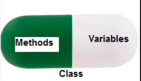

# POLYMORPHISIM:

- Polymorphism contains two words "poly" and "morphs". Poly means many, and morph means shape.
- Polymorphism simply means having many forms.
- By polymorphism, we understand that one task can be performed in different ways.
- For example - lets say there is a class Vehicle, and all vehicles run. But they run differently. Here, the "run" behavior is polymorphic in a sense and depends on the vehicle. So, the abstract "vehicle" concept does not actually "run", but specific vehicles (like cars and bikes) have a concrete implementation of the action "speak".
- In programming, polymorphism means the same function name (but different signatures) being used for different types. The key difference is the data types and number of arguments used in function.
- It refers to the use of a single type entity (method, operator or object) to represent different types in different scenarios.

> Example 1: Polymorphism in addition operator(t does not have a single usage.)

```py
# For integer data types, + operator is used to perform arithmetic addition operation.
num1 = 1
num2 = 2
print(num1+num2)

#  for string data types, + operator is used to perform concatenation.
str1 = "Python"
str2 = "Programming"
print(str1+" "+str2)
```

- Here, we can see that a single operator + has been used to carry out different operations for distinct data types. This is one of the most simple occurrences of polymorphism in Python.

> Example 2: in-built polymorphic functions:

- len() function can run with many data types in Python

```py
# len() function is used for a string
print (len("Javatpoint"))

# len() function is used for a list
print (len([110, 210, 130, 321]))
```

```
10
4
```

> Examples 3: user-defined polymorphic functions::

```py
def add(p, q, r = 0):
    return p + q + r

print (add(6, 23))
print (add(22, 31, 544))
```

## Polymorphism with Class Methods:

- We can use the concept of polymorphism while creating class methods as Python allows different classes to have methods with the same name.
- Polymorphism allows objects of different classes to be treated as objects of a common superclass

```py
class Student1():
    def display(self):
        print("Name : Ravi")

class Student2():
    def display(self):
        print("Name : Darshan")

obj1 = Student1()
obj2 = Student2()
for obj in (obj1, obj2):
    obj.display()
```

- However, notice that we have not created a common superclass or linked the classes together in any way. Even then, we can pack these two different objects into a tuple and iterate through it using a common animal variable. It is possible due to polymorphism.
- This ability to treat different classes with a common interface (in this case, the display() method) is an example of polymorphism

## Polymorphism with Inheritance (Method Overriding):

- In Python, Polymorphism lets us define methods in the child class that have the same name as the methods in the parent class. In inheritance, the child class inherits the methods from the parent class(i.e the methods of the parent class are passed to the child class). However, it is possible to modify a method in a child class which it has inherited from the parent class. This is particularly useful in cases where the method inherited from the parent class doesn’t quite fit the child class. In such cases, we re-implement the method in the child class. This process of re-implementing a method in the child class is known as Method Overriding.

```py
class Vehicle:
    def drive(self):
        print("Vehicle is moving")

class Car(Vehicle):
    def drive(self):
        print("Car is driving")

class Bike(Vehicle):
    def drive(self):
        print("Bike is riding")

# Create instances of the child classes
car = Car()
bike = Bike()

# Call the overridden methods
car.drive()  # Output: "Car is driving"
bike.drive()  # Output: "Bike is riding"
```

- In the above example: We have a Parent class Vehicle with a method drive().
- We have two child classes, Car and Bike, both inheriting from the parent class, Vehicle.
- Each child class overrides the drive() method to provide a specific message for the type of vehicle.
- When we create instances of the child classes and call the drive() method, the overridden methods in the child classes are used to indicate how each type of vehicle moves.
- This demonstrates method overriding by allowing the child classes to provide their own implementation of the drive() method based on their specific characteristics.

## Polymorphism with a Function and objects: :

- It is also possible to create a function that can take any object. This allows for polymorphism.
- In this example, let’s create a function called “func()” which will take an object which we will name “obj”.
- Next, let’s give the function something to do with the ‘obj’ object that we passed to it.
- In this case, let’s call the two methods, capital(), language(), each of which is defined in the two classes ‘India’ and ‘USA’.
- Next, let’s create instantiations of both the ‘India’ and ‘USA’ classes if we don’t have them already.
- With those, we can call their actions using the same func() function:

```py
def func(obj):
    obj.capital()
    obj.language()

objIndia = India()
objUsa = USA()

func(objIndia)
func(objUsa)
```

> Code: Implementing Polymorphism with a Function :

```py
class India():
    def capital(self):
        print("Capital of India: New Delhi")

    def language(self):
        print("Lang of India: Hindi")

class USA():
    def capital(self):
        print("Capital of USA: Washington DC")

    def language(self):
        print("Lang of USA: Engliah")


def func(obj):
    obj.capital()
    obj.language()

objIndia = India()
objUsa = USA()

func(objIndia)
func(objUsa)
```

## Programs on Polymorphisim:

- Create a Parent class Animal with a method make_sound(). Create child classes Dog and Cat that override the make_sound() method to print different sounds. Demonstrate polymorphism by creating instances of both child classes and calling their make_sound() methods

```py
class Animal:
    def make_sound(self):
        pass

class Dog(Animal):
    def make_sound(self):
        print("Bark!")

class Tiger(Animal):
    def make_sound(self):
        print("Roar!")

dog = Dog()
tiger = Tiger()

dog.make_sound()  # Output: Bark
tiger.make_sound()  # Output: Roar

```

- Design a payment system using polymorphism. Create a base class Payment with a method process_payment(). Implement subclasses CreditCardPayment and PayPalPayment with their own implementations of process_payment(). Demonstrate polymorphism by processing payments using different payment methods.

```py
class Payment:
    def process_payment(self, amount):
        pass

class CreditCardPayment(Payment):
    def process_payment(self, amount):
        print(f"Processed credit card payment of ${amount}")

class PayPalPayment(Payment):
    def process_payment(self, amount):
        print(f"Processed PayPal payment of ${amount}")

credit_card = CreditCardPayment()
paypal = PayPalPayment()

credit_card.process_payment(100)  # Output: Processed credit card payment of $100
paypal.process_payment(50)        # Output: Processed PayPal payment of $50

```

- Develop a vehicle rental system using polymorphism. Create a base class Vehicle with methods like get_rental_price() and display_info(). Implement subclasses Car and Bike with their own implementations of these methods. Demonstrate polymorphism by calculating rental prices and displaying information for both vehicle types.

```py
class Vehicle:
    def __init__(self, make, model):
        self.make = make
        self.model = model

    def get_rental_price(self):
        pass

    def display_info(self):
        print(f"{self.make} {self.model}")

class Car(Vehicle):
    def get_rental_price(self):
        return 50  # Sample rental price calculation

class Bike(Vehicle):
    def get_rental_price(self):
        return 20  # Sample rental price calculation

car = Car("Toyota", "Camry")
bike = Bike("Honda", "CBR")

car.display_info()       # Output: Toyota Camry
print(car.get_rental_price())  # Output: 50
bike.display_info()      # Output: Honda CBR
print(bike.get_rental_price()) # Output: 20

```

- Create a Parent class Shape with an abstract method calculate_area(). Implement child classes Rectangle and Circle that calculate and return their respective areas. Show polymorphism by calling the calculate_area() method on instances of both child classes.

```py
from abc import ABC, abstractmethod

class Shape(ABC):
    @abstractmethod
    def calculate_area(self):
        pass

class Rectangle(Shape):
    def __init__(self, width, height):
        self.width = width
        self.height = height

    def calculate_area(self):
        return self.width * self.height

class Circle(Shape):
    def __init__(self, radius):
        self.radius = radius

    def calculate_area(self):
        return 3.14 * self.radius ** 2

rectangle = Rectangle(5, 3)
circle = Circle(4)

print(rectangle.calculate_area())  # Output: 15
print(circle.calculate_area())     # Output: 50.24

```

# Python Encapsulation:

- Process of wrapping data and the methods that work on the data within one unit.
- This puts restrictions on accessing variables and methods directly and can prevent the accidental modification of data.
- To prevent accidental change, an object’s variable can only be changed by an object’s method. Those types of variables are known as private variables.
- A class is an example of encapsulation as it encapsulates all the data that is member functions, variables, etc.

- 

- The goal of information hiding is to ensure that an object’s state is always valid by controlling access to attributes that are hidden from the outside world.

- Consider a real-life example of encapsulation, in a company, there are different sections like the accounts section, finance section, sales section etc. The finance section handles all the financial transactions and keeps records of all the data related to finance. Similarly, the sales section handles all the sales-related activities and keeps records of all the sales. Now there may arise a situation when due to some reason an official from the finance section needs all the data about sales in a particular month. In this case, he is not allowed to directly access the data of the sales section. He will first have to contact some other officer in the sales section and then request him to give the particular data. This is what encapsulation is. Here the data of the sales section and the employees that can manipulate them are wrapped under a single name “sales section”.

## Public Members:

- These are accessible from anywhere, both within the class and outside of it. They are typically defined without any name mangling or special naming conventions

## Protected members

- indicated by a single underscore prefix (e.g., \_protected_variable)
- It suggests that the attribute or method should not be accessed outside the class or its subclasses, but it doesn't enforce this.
- Although the protected variable can be accessed out of the class as well as in the derived class (modified too in derived class), it is convention to not access the protected out the class body.

```py
class Base:
    def __init__(self):
        self._value = 20 # Protected member

class Derived(Base):
    def __init__(self):

        Base.__init__(self)

        print("Protected member of base class: ", self._value)

        self._value = 30
        print("After Modification: ", self._value)


obj1 = Derived()
obj2 = Base()

# protected member Can be accessed but should not be done due to convention
print("Protected member of obj1: ", obj1._value)

# Accessing the protected variable outside
print("Protected member of obj2: ", obj2._value)
```

```
Protected member of base class:  20
After Modification:  30
Protected member of obj1:  30
Protected member of obj2:  20
```

## Private members:

- Private members are similar to protected members, the difference is that the class members declared private should neither be accessed outside the class nor by any base class. In Python, there is no existence of Private instance variables that cannot be accessed except inside a class.
- Note: Python’s private and protected members can be accessed outside the class through python name mangling.
- Private attributes are defined using double underscores
- We cannot even access private attribute directly and can’t even change its value.

```py
class Vehicle:
        name = "Ford"  # public attribute
        __price = "13 lakh"   # private Attribute

print(Vehicle.name) # Ford
print(Vehicle.price) # AttributeError
```

```py
# Python program to demonstrate private members
# Base class
class Vehicle:
    def __init__(self):
        self.name = "Ford"
        self.__price = "13 lakh"   # private attribute

class Car(Vehicle):
    def __init__(self):
        Vehicle.__init(self)
        print(self.__price)


obj1 = Vehicle()
print(obj1.name) # Ford

print(obj1.price)  # AttributeError

obj2 = Car()  # AtrributeError as private member of base class is called inside derived class
```

## Public, private and protected:

```py
class Vehicle:
    def __init__(self):
        self.name = "Ford"            # Public
        self._price = "13 lakh"       # Protected
        self.__mileage = "20 km/l"    # Private

vehicle = Vehicle()

print(vehicle.name)      # Accessing a public member
print(vehicle._price)    # Accessing a protected member (convention, not enforcement)
# print(vehicle.__mileage)  # TAttributeError

print(vehicle._Vehicle__mileage)  # Name mangling to access the private member

```

## DATA ABSTRACTION:

- It hides unnecessary code details from the user. Also, when we do not want to give out sensitive parts of our code implementation and this is where data abstraction came.
- Data Abstraction in Python can be achieved by creating abstract classes
- Data abstraction and encapsulation both are often used as synonyms. Both are nearly synonyms because data abstraction is achieved through encapsulation.
- Abstraction is used to hide internal details and show only functionalities. Abstracting something means to give names to things so that the name captures the core of what a function or a whole program does.

## Data Hiding and Object Printing:

> Data hiding:

- In Python, we use double underscore (Or \_\_) before the attributes name and those attributes will not be directly visible outside.

```py
class MyClass:

    # Hidden member of MyClass
    __hiddenVariable = 0

    # A member method that changes
    # __hiddenVariable
    def add(self, increment):
        self.__hiddenVariable += increment
        print (self.__hiddenVariable)

# Driver code
myObject = MyClass()
myObject.add(2)
myObject.add(5)

# This line causes error
print (myObject.__hiddenVariable)
```

```
2
7
Traceback (most recent call last):
  File "filename.py", line 13, in
    print (myObject.__hiddenVariable)
AttributeError: MyClass instance has
no attribute '__hiddenVariable'
```

- In the above program, we tried to access a hidden variable outside the class using an object and it threw an exception.
- We can access the value of a hidden attribute by a tricky syntax:

```py
# A Python program to demonstrate that hidden
# members can be accessed outside a class
class MyClass:

    # Hidden member of MyClass
    __hiddenVariable = 10

# Driver code
myObject = MyClass()
print(myObject._MyClass__hiddenVariable)
```

```
10
```

- Private methods are accessible outside their class, just not easily accessible. Nothing in Python is truly private; internally, the names of private methods and attributes are mangled and unmangled on the fly to make them seem inaccessible by their given names

> Printing Objects:

- Printing objects give us information about objects we are working with. In C++, we can do this by adding a friend ostream& operator << (ostream&, const Foobar&) method for the class. In Java, we use toString() method.
  In python, this can be achieved by using **repr** or **str** methods.

```py
class Test:
    def __init__(self, a, b):
        self.a = a
        self.b = b

    def __repr__(self):
        return "Test a:%s b:%s" % (self.a, self.b)

    def __str__(self):
        return "From str method of Test: a is %s," \
              "b is %s" % (self.a, self.b)

# Driver Code
t = Test(1234, 5678)
print(t) # This calls __str__()
print([t]) # This calls __repr__()
```

```
From str method of Test: a is 1234,b is 5678
[Test a:1234 b:5678]
```

> Important Points about Printing:

- If no **str** method is defined, print t (or print str(t)) uses **repr**.

```py
class Test:
    def __init__(self, a, b):
        self.a = a
        self.b = b

    def __repr__(self):
        return "Test a:%s b:%s" % (self.a, self.b)

# Driver Code
t = Test(1234, 5678)
print(t)
```

```
Test a:1234 b:5678
```

> If no **repr** method is defined then the default is used:

```py
class Test:
    def __init__(self, a, b):
        self.a = a
        self.b = b

# Driver Code
t = Test(1234, 5678)
print(t)
```

```
<__main__.Test instance at 0x7fa079da6710>
```
