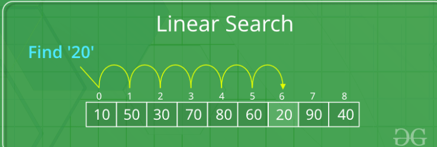

# Best , Average and Worst Case

- Consider the below example:

```py
# program to find sum of elements of a list

mylist = [1,2,3,4]
n = len(mylist)
def getSum(mylist, n):

    sum = 0    # c2 (executes only once)

    for i in range(n):
        sum=sum+mylist[i]  # nc1 (becoz it executes linear number of times)

    return sum # c2 (executes only once)

# Time Taken: nc1 + c2
# order of growth = n i.e linear
```

- consider another example:

```py
mylist = [1,2,3,4]
n = len(mylist)
def getSum(mylist, n):

    if n%2 == 0:   # even sized list
        return 0

    sum = 0    # c2 (executes only once)

    for i in range(n):
        sum=sum+mylist[i]  # nc1 (becoz it executes linear number of times)

    return sum # c2 (executes only once)

```

- here we cannot make a general statement that the order of growth is linear or constant because it depends on the type of input i.e even or odd
- If user input is even sized array, it will take constant time
- If user input is odd sized array, it will take linear time
- Thats why divide algorithms into three cases: Best, Average and worst

> Best Case:

- Best Case: minimum number of growth of an algorithm

```
Best case = constant i.e when the user provides even sized list
```

- Best case is bogus.Not used that much

> Average Case:

- Average case = Time taken by all the inputs / Number of inputs
- Most of the time we don't know how many inputs user will provide. In those cases we take assumptions.
- So in this code we assume that user provides half of the time even input and half of the time odd input
- Half of the time = linear when user provides odd sized array
- Half of th time = constant when user provides even sized array.
- so time taken = ((c1n + c2) + c3) / 2 = c1n/2 + c2/2 + c3/2
- Ignore the lower order terms and constant. time taken = n i.e linear
- So avg case requires us to make certain assumptions in the input or in ideal situation, requires to know the exact input.
- So avg case is not typically considered

> Worst case:

- We find the input size for which the fun will take maximum time or order of growth
- In this case if the user provides odd sized list, it will take maximum time
- so worst case: linear

# Searching Algorithms:

# Linear Search Algorithm:

- Linear Search is defined as a sequential search algorithm that starts at one end and goes through each element of a list until the desired element is found, otherwise the search continues till the end of the data set.



- If any element is found equal to the key, the search is successful and the index of that element is returned.

- If no element is found equal to the key, the search yields “No match found”.

# Example:

```
mylist = [10,20,40,30,5,80]
key = 40
```

```py
def search(mylist, N, key):

    for i in range(0, N):
        if (mylist[i] == key):
            return i
    return -1


mylist = [10,20,40,30,5,80]
key = 40
N = len(mylist)

result = search(mylist, N, key)

if(result == -1):
    print("Not Present")
else:
    print("Element is present at index", result)
```

# Complexity of Linear Search:

## Time Complexity:

> Best Case:

- Key present at the first index.
- So best case complexity is O(1) i.e constant time irrespective of the size of list
- In all three noataions:

```
- Big O : O(1)
- Omega : Ω(1)
- Theta : Θ(1)

because, in the best case, only one comparison is needed to find the target element
```

> Worst Case:

- the key is present at the last index
- worst-case complexity is O(n)
- In all three noataions:

```
- Big O : O(n)
- Omega : Ω(1) # becoz even in the worst case, the algorithm performs at least one comparison

- Theta : Θ(n) # both the upper and lower bounds are linear.

because, in the best case, only one comparison is needed to find the target element
```

> Average Case:

- Average case complexity is O(n)
- The average-case time complexity of linear search is generally represented using Big O notation (O), as it gives an upper bound on the number of operations the algorithm performs on average.
- While average-case complexity is not commonly expressed using Omega (Ω) or Theta (Θ) notation, it's important to note that the average case for linear search can vary depending on factors such as the distribution of elements and the position of the target element within the list. In a uniform distribution, the average case might approach O(n/2), but this is still simplified to O(n) for practical purposes.

## Space Complexity:

> Auxillary Space:

- O(1) as except for the variable to iterate through the list, no other variable is used.

## Advantages of Linear Search:

- can be used irrespective of whether the list is sorted or not.
- It can be used of list of any data type
- Does not require any additional memory.

## Disadvantages of Linear Search:

- has a time complexity of O(N), which in turn makes it slow for large datasets.

## When to use Linear Search?

- When we are dealing with a small dataset.

# Binary Search Algorithm:

- Designed for searching in sorted data-structures.
- It is much more efficient than Linear Search as they repeatedly target the center of the search structure and divide the search space in half.
- For example:
- Binary Search to find the element “23” in a given list of numbers:


- Binary Search is defined as a searching algorithm used in a sorted array by repeatedly dividing the search interval in half. The idea of binary search is to use the information that the array is sorted and reduce the time complexity to O(log N).

> CONDITIONS:

- The data must be sorted
- Access to any element of the data structure takes constant time

# STEPS:

- Divide the search space into two halves by finding the middle index “mid”.

```
mid =  low + (high-low)/2

or

mid = (low+ high)/2
```

- Compare the middle element of the search space with the key.
- If the key is found at middle element, the process is terminated.
- If the key is not found at middle element, choose which half will be used as the next search space.
- If the key is smaller than the middle element, then the left side is used for next search.
- If the key is larger than the middle element, then the right side is used for next search.
- This process is continued until the key is found or the total search space is exhausted.

# Example:

- Consider an list = [2, 5, 8, 12, 16, 23, 38, 56, 72, 91]
- Key = 23
- Calculate the mid and compare the mid element with the key
- if key < mid , move search space to left
- if key > mid , move search space to right

```
# list = [2, 5, 8, 12, 16, 23, 38, 56, 72, 91]

low = 0
high = 9

mid = 4

list[mid] = 16
=> key(23) > mid
=> move to right
```

```
low = mid + 1 = 5
High = 9

mid = (5+9)/2 = 7

list[mid] = 56

=> key(23) < mid
=> move to left
```

```
low = 5
high = mid-1 = 6

mid = (5+6)/2 = 5

list[mid] = 23 = key

Element found, return index
```

# WAYS TO IMPLEMENT BINARY SEARCH:

- Iterative Binary Search Algorithm
- Recursive Binary Search Algorithm

## Iterative Binary Search:

```py
def binarySearch(mylist, low, high, key):

    while low <= high:

        mid = low + (high - low) // 2

        # Check if key is present at mid
        if mylist[mid] == key:
            return mid

        # If key is greater, ignore left half
        elif mylist[mid] < key:
            low = mid + 1

        # If key is smaller, ignore right half
        else:
            high = mid - 1

    return -1


mylist = [2, 3, 4, 10, 40]
key = 10

result = binarySearch(mylist, 0, len(mylist)-1, key)

if result != -1:
    print("Element is present at index", result)
else:
    print("Element is not present in array")
```

- Time Complexity = O(log N)
- Binary search algorithm divides the input array in half at every step, reducing the search space by half, and hence has a time complexity of logarithmic order.
- Auxillary Space = O(1)
- Binary search algorithm requires only constant space for storing the low, high, and mid indices, and does not require any additional data structures, so its auxiliary space complexity is O(1).

## Recursive Binary Search:

```py
def binarySearch(mylist, low, high, key):

    if low <= high:

        mid = low + (high - low) // 2

        # Check if key is present at mid
        if mylist[mid] == key:
            return mid

        # If key is greater, ignore left half
        elif mylist[mid] < key:
            return binarySearch(mylist, mid + 1, high, key)
            low = mid + 1

        # If key is smaller, ignore right half
        else:
            return binarySearch(mylist, low, mid-1, key)

    return -1


mylist = [2, 3, 4, 10, 40]
key = 10

result = binarySearch(mylist, 0, len(mylist)-1, key)

if result != -1:
    print("Element is present at index", result)
else:
    print("Element is not present in array")

```

> Time Complexity:

```
Best Case: O(1)
Average Case: O(log N)
Worst Case: O(log N)
```

> Space complexity

- Auxiliary Space: O(1), If the recursive call stack is considered then the auxiliary space will be O(logN).

# Advantages of Binary Search:

- faster than linear search, especially for large lists

# Disadvantages:

- The list should be sorted
- It requires that the data structure being searched be stored in contiguous memory locations.

# Applications of Binary Search:

- for searching a database.
- or searching in computer graphics such as algorithms for ray tracing or texture mapping.

# FORMULA OF BINARY SEARCH:

```
mid = (low + high)/2.
```

- It fails for large values of low and high. Specifically, it fails if the sum of low and high is greater than the maximum positive value of int data type (i.e., 231 – 1). The sum overflows to a negative value, and the value stays negative when divided by two. This causes an array index out of bounds with unpredictable results

```
int mid = low + ((high – low) / 2);
```

# Sorting
